# BFF Architecture - Visual Diagrams

This document contains visual diagrams for the BFF architecture migration.

---

## 1. High-Level Architecture

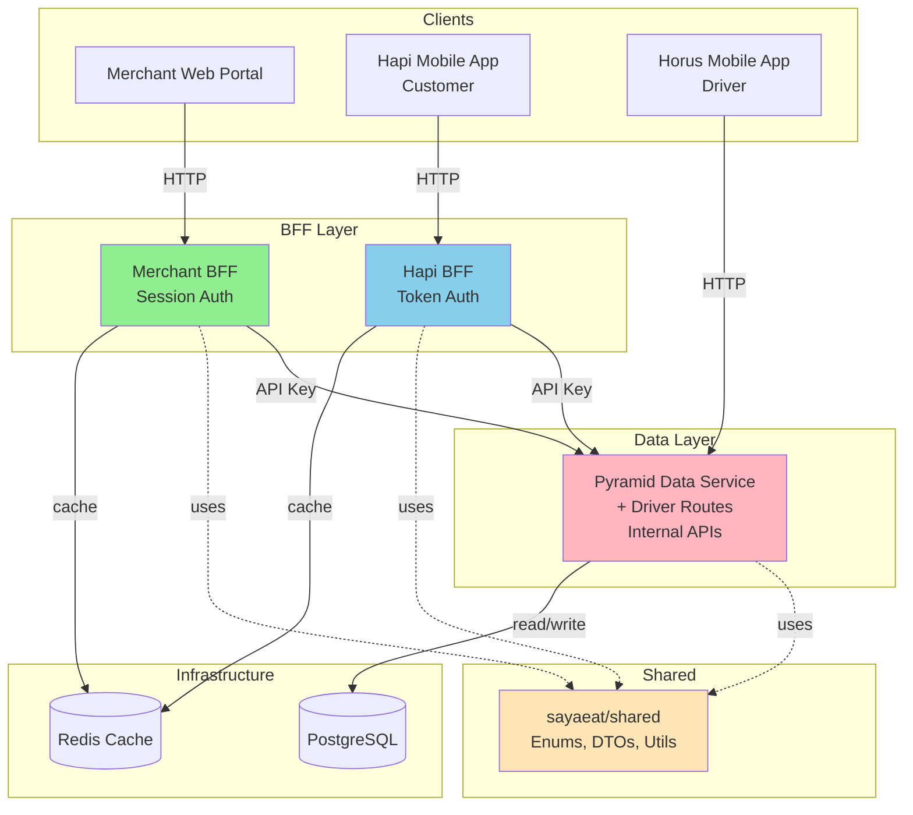

---

## 2. Authentication Flow - Merchant BFF

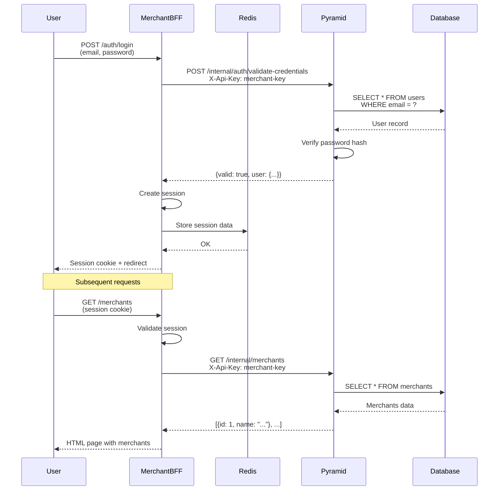

---

## 3. Authentication Flow - Hapi BFF (Token-Based)

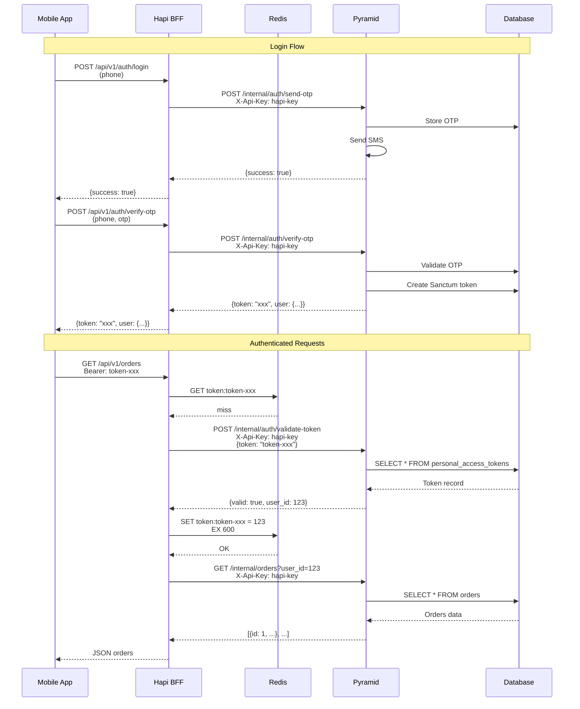

---

## 4. Data Flow - Creating an Order

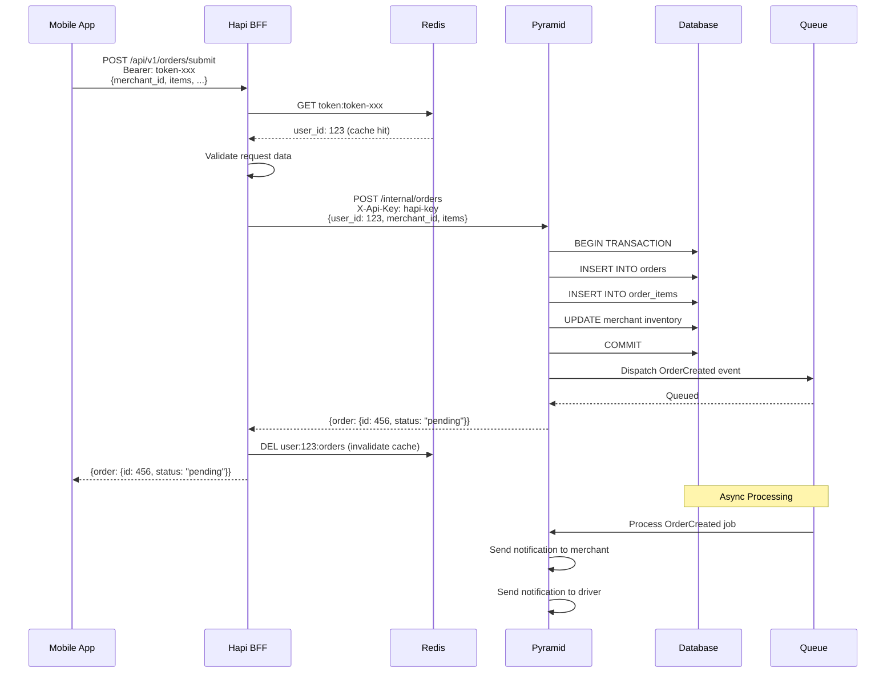

---

## 5. Current vs. Future Architecture

### Current (Monolith)

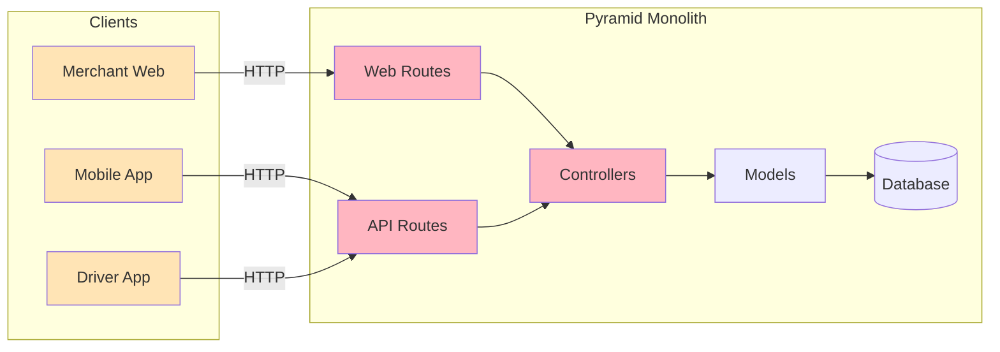

### Future (BFF Pattern)

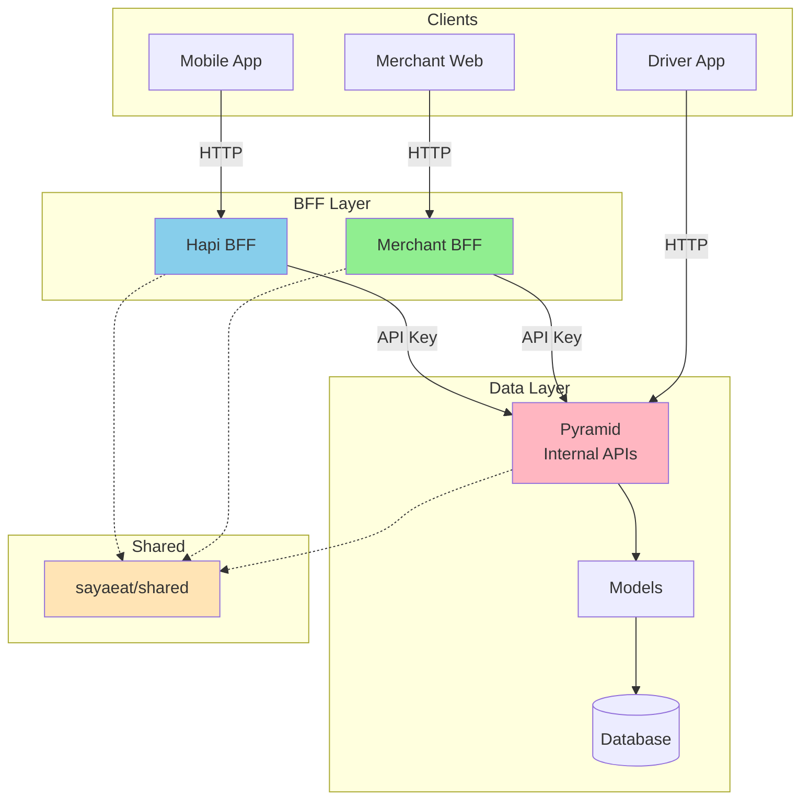

---

## 6. Caching Strategy

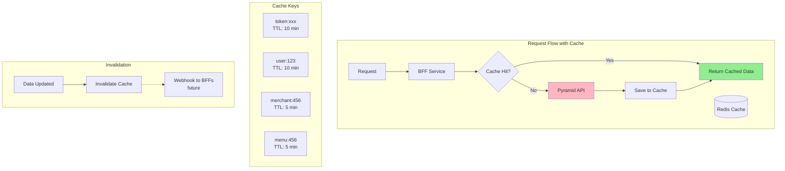

---

## 7. Migration Phases

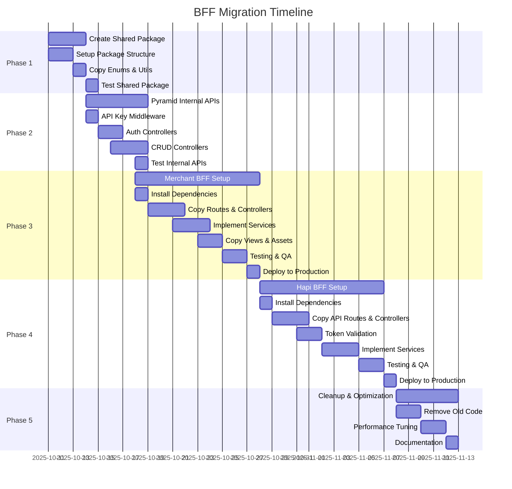

---

## 8. Service Communication Patterns

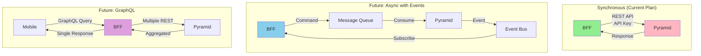

---

## 9. Error Handling & Retry Logic

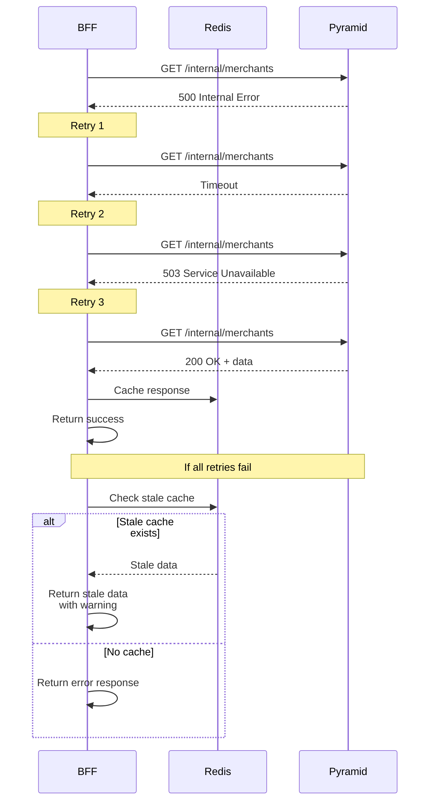

---

## 10. Deployment Strategy

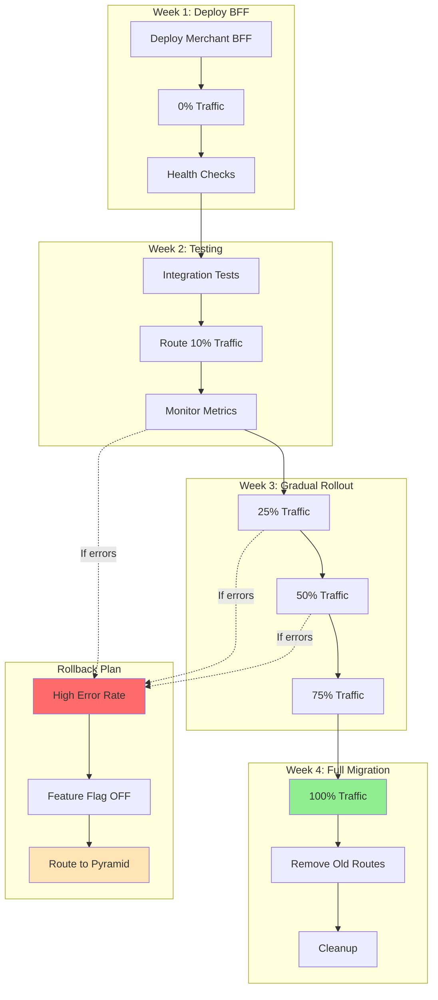

---

## Legend

- 🟢 Green: BFF Services
- 🔵 Blue: Hapi BFF
- 🔴 Pink: Pyramid Data Service
- 🟡 Yellow: Shared Components
- ⚪ Gray: Infrastructure

---

**Note:** These diagrams can be rendered using Mermaid in GitHub, GitLab, or documentation tools that support Mermaid syntax.

**Last Updated:** October 11, 2025

